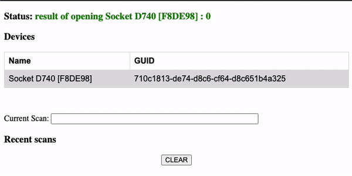

# SingleEntryJS

SingleEntryJS is a very simple HTML and JS boilerplate app using the Socket Mobile JavaScript Capture Module. If you are looking for the React project example, the repo can be found [here](https://github.com/SocketMobile/single-entry-react).

It shows how to use the Socket Mobile CaptureJS SDK to receive the decoded data from the Socket Mobile devices into an input box.

The connection state of the Socket Mobile device is shown in a status field at the top of the app.

## Requirements

1. You will need your Socket Mobile developer ID as well as an app ID. Your developer ID can be found under your developer profile when you log into the [Socket Mobile Developer Portal](https://www.socketmobile.com/developers/portal). Then you need to [create your appKey](https://www.socketmobile.com/developers/portal/application-details/appkey-registration). For platform, select Web. For Language/Capture Client, select JavaScript. Your bundleId needs to be in the format of `socketmobile.com.yourappname`.
2. The scanner needs to be paired with your devices in Application Mode. This can be done using the Socket Mobile Companion app (recommended), which can be downloaded from the [App Store](https://apps.apple.com/us/app/socket-mobile-companion/id1175638950). To pair your scanner in Application Mode without using Companion app, follow the instructions at: ConfigureInAppMode.

## Install

You shouldn't need to install anything in order to use this boilerplate. However, if you want to temporarily host your app securely, you can install `ngrok` and follow the directions from this blog post (link to my blog post about using SimpleHTTPServer and ngrok).

## Usage

To run the web app on your laptop, connect an android device to the same machine so you can use `adb`. Then, use the Socket Mobile Companion app to connect your scanner to your attached device. Once you have successfully connected your scanner to your device, configure your credentials for your app (see below) and then in your project root, run `adb forward tcp:18481 tcp:18481` in the command line.

Your generated appInfo should look something like the below...

```
let appInfo = {
    appId: "web:socketmobile.com.singleentryjs",
    developerId: '289d7d25-20ea-eb11-bacb-000d3a5b57ef',
    appKey: 'MC4CFQDTXgyqNtrLf0MODRcyn2slp3K4/wIVAMe4pKxYfyqGbvVeqv46nqMcEC/P'
};
```

The capture initialization takes place in an `DOMContentLoaded` event listener to ensure the cdn is loaded before you try to use the SocketMobile prefix.

```
window.addEventListener('DOMContentLoaded', ()=>{

    var capture = new SocketMobile.Capture();

    capture.open(appInfo, onCaptureEvent)
        .then(result => {
            console.log('opening Capture result: ', result);
            updateStatus(`opening Capture result: ${result}`)
        })
        .catch(err => {
            var val;
            // error code to watch for to check if the Companion service is running
            if(err === SocketMobile.SktErrors.ESKT_UNABLEOPENDEVICE){
                val='not able to connect to the service, is it running?'
                console.log('no able to connect to the service, is it running?');
            }
            else {
                val = `opening Capture error: ${err}`;
            }
            console.log(val)
            updateStatus(val, err)
        });
})
```

Finally, `onCaptureEvent` is used to handle the data that comes back from a successfully opened capture instance and apply three conditionals; detecting devices, removing devices and processing scanned data.

```
const onCaptureEvent = (e, handle) => {
    const {CaptureEventIds, Capture} = SocketMobile
    if (!e) {
        return;
    }
    switch (e.id) {
        case CaptureEventIds.DeviceArrival: //detecting devices; scanner connects to companion/device
        ...
        break
        case CaptureEventIds.DeviceRemoval: //removing devices; scanner connects to companion/device
        ...
        break
        case CaptureEventIds.DecodedData: //processing captured data; executed when you scan a code
        ...
        break
    }
}
```

We've provided some logic to handle adding devices, removing devices, scanning items and storing those scan results (and connected devices) and adding them to the DOM. Below is what your boilerplate should look like after connecting a scanner and scanning a few tags.



## The Live JS Demo

You can check out the live JS demo [here](https://singleentry.socketmobile.dev/).

### Live Demo on Mac

To view the live demo on Mac, you will need to attach an Android device in order to use the Companion service. Once you connect your device, open your terminal and run `adb forward tcp:18481 tcp:18481`. You should then be able to open it in your browser!

**Note**: If you are using Brave, you will first need to disable shields. You can do this by going to _Brave > Settings > Shields > Trackers & ads blocking_ and select _disable_. Once these are disabled, refresh the webpage running the live demo app and it should work normally.

### Live Demo on iOS

Since the companion service is not present on iOS, you will need to open the live demo in Rumba, Socket Mobile's web browser with CaptureSDK integrated into it. You can download Rumba from the App Store [here](https://apps.apple.com/us/app/rumba-by-socket-mobile/id971935166).
